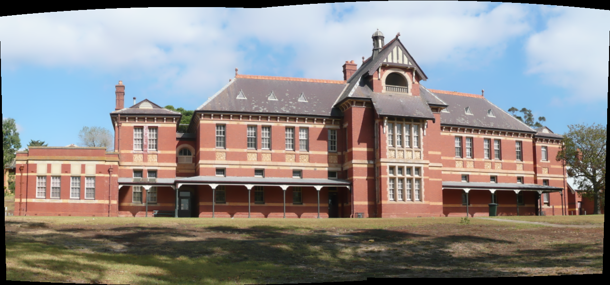

# Image Stitcher
## Author
Jason Chan

## Overview
This is a simple program with GUI that allows user to stitch 2 images together. The stitching method is implemented using OpenCV.

## Sample
Input images:

Output image:

